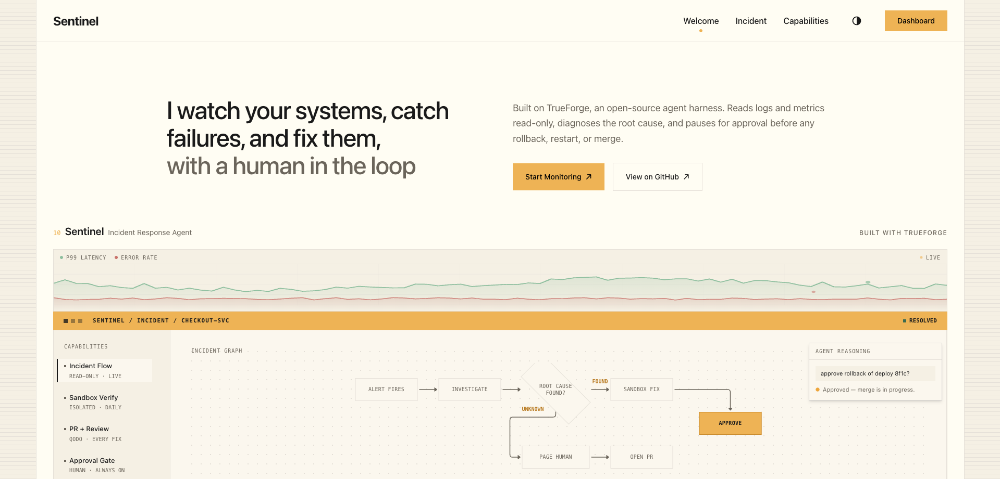
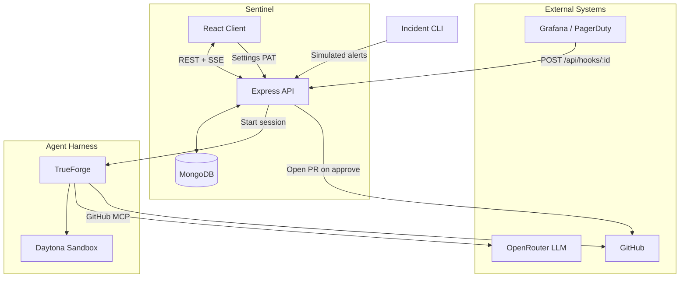
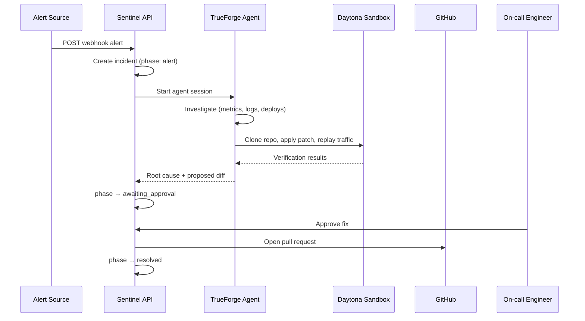
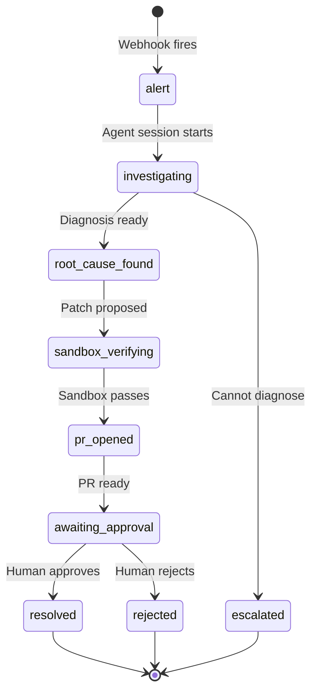

<h1 align="center">Sentinel</h1>

<p align="center">
  <strong>AI-native SRE incident response — from alert to verified fix, with a human in the loop.</strong>
</p>

<p align="center">
  
  
  
</p>

<p align="center">
  <a href="#-features">Features</a> ·
  <a href="#-architecture">Architecture</a> ·
  <a href="#-quick-start">Quick Start</a> ·
  <a href="#-real-mode-flow">Real Mode</a> ·
  <a href="#-incident-cli">Incident CLI</a> ·
  <a href="#-project-structure">Structure</a> ·
  <a href="CONTRIBUTING.md">Contributing</a> ·
  <a href="#code-review-with-qodo">Qodo Review</a>
</p>

<p align="center">
  
</p>

---

Sentinel is an SRE incident-response platform built for the **WeMakeDevs hackathon**. It connects monitoring alerts to an AI agent that investigates root cause, verifies fixes in an isolated sandbox, and opens a GitHub PR — but **never ships without human approval**.

Try it instantly in **Demo mode** (no API keys), or run the full stack in **Real mode** with TrueForge, Daytona, and GitHub.

---

## ✨ Features

| Capability | Description |
|------------|-------------|
| **Dual modes** | **Demo** — scripted simulator, zero setup. **Real** — live webhooks, TrueForge agent, GitHub PRs. |
| **Webhook ingestion** | Accept alerts from Grafana, PagerDuty, or any JSON POST with `X-Sentinel-Secret`. |
| **AI investigation** | TrueForge agent reads metrics, logs, and repo context via MCP tools. |
| **Sandbox verification** | Daytona sandbox replays traffic against patched config before any production change. |
| **Human approval gate** | Agent proposes fixes; humans approve or reject before merge. |
| **Live incident dashboard** | Phase stepper, event log, metrics sparkline, investigation graph, diff viewer. |
| **Incident CLI** | Judge-friendly CLI to fire realistic alerts in seconds — no Grafana required. |

---

## 🏗 Architecture

### System overview



### Real-mode incident flow



### Incident lifecycle



---

## 🚀 Quick Start

### Prerequisites

- **Node.js** 20+ (24 recommended)
- **MongoDB** running locally or remote
- *(Real mode only)* [TrueForge](https://github.com/truefoundry/trueforge), OpenRouter API key, Daytona API key, GitHub PAT

### 1. Clone and install

```bash
git clone https://github.com/ronak-pal1/Sentinel.git
cd Sentinel
```

### 2. Start the server

```bash
cd server
cp .env.example .env
npm install
npm run dev
```

Server runs at `http://localhost:3000`.

### 3. Start the client

```bash
cd client
npm install
npm run dev
```

Open `http://localhost:5173`, create a profile, and choose **Demo** or **Real** mode.

---

## 🔴 Demo vs Real Mode

| | **Demo** | **Real** |
|---|----------|----------|
| Setup | None | GitHub PAT, webhooks, TrueForge |
| Alerts | `Break It` button + simulator | Webhook POST or Incident CLI |
| Agent | Scripted timeline | TrueForge + OpenRouter |
| Sandbox | Simulated results | Daytona via TrueForge |
| PRs | Mock URL | Real GitHub PR on approval |

**Demo mode** is perfect for exploring the UI and incident lifecycle without any credentials.

**Real mode** runs the full pipeline: webhook → agent → sandbox → approval → PR.

---

## ⚡ Real Mode Flow

### 1. Bootstrap TrueForge (one-time)

```bash
# TrueForge must be running: npx @truefoundry/trueforge
# Add to server/.env:
#   DAYTONA_API_KEY, OPENROUTER_API_KEY, OPENROUTER_MODEL_ID, GITHUB_TOKEN
cd server && npm run setup:trueforge
```

This registers the `sentinel` agent with OpenRouter, GitHub MCP, and Daytona sandbox enabled.

### 2. Connect GitHub

Sentinel **Settings** → paste a GitHub PAT (used for PR creation; separate from TrueForge's GitHub MCP token).

### 3. Create a webhook

**Webhooks** → select a repo → copy the **URL** and **`X-Sentinel-Secret`** (shown once).

Set `SERVER_PUBLIC_URL` in `server/.env` if not using `http://localhost:3000`.

### 4. Fire an alert

```bash
curl -X POST http://localhost:3000/api/hooks/wh-XXXXX \
  -H "Content-Type: application/json" \
  -H "X-Sentinel-Secret: YOUR_SECRET" \
  -d '{"service":"checkout-svc","alertType":"HighErrorRate","message":"p99 latency exceeded 2s"}'
```

### 5. Watch and approve

Open **Incidents** → follow the investigation → review the diff → **Approve** or **Reject**.

---

## 🎯 Incident CLI

For hackathon demos and judge testing — trigger realistic alerts without Grafana:

```bash
cd incident-cli
npm install
npm run dev
```

The CLI walks you through webhook URL, secret, payload format, and scenario selection. Presets include latency spikes, error rates, memory leaks, and DB pool exhaustion.

**One-shot mode:**

```bash
npm run dev -- fire \
  --url http://localhost:3000/api/hooks/wh-abc123 \
  --secret YOUR_SECRET \
  --scenario latency \
  --format generic
```

See [incident-cli/README.md](incident-cli/README.md) for full documentation.

---

## 📁 Project Structure

```
Sentinel/
├── client/                 # React 19 + Vite + Tailwind frontend
│   └── src/
│       ├── pages/app/      # Dashboard, incidents, webhooks, settings
│       ├── components/     # Flow graphs, dashboard widgets
│       └── lib/            # API client, incident providers, simulator
├── server/                 # Express 5 + MongoDB API
│   └── src/
│       ├── routes/         # REST endpoints
│       ├── services/       # Orchestrator, TrueForge, GitHub, webhooks
│       ├── models/         # Mongoose schemas
│       └── scripts/        # TrueForge bootstrap
├── incident-cli/           # Webhook trigger CLI for demos
├── docs/assets/            # Screenshots and assets
└── .github/workflows/      # EC2 deployment (client + server)
```

---

## 🛠 Tech Stack

| Layer | Technologies |
|-------|-------------|
| **Frontend** | React 19, Vite, Tailwind CSS 4, React Flow |
| **Backend** | Express 5, Mongoose, Zod, SSE |
| **Database** | MongoDB |
| **Agent** | TrueForge SDK, OpenRouter, Daytona sandbox |
| **Integrations** | GitHub (Octokit + MCP), Grafana/PagerDuty webhooks |
| **CLI** | Commander, Inquirer, Chalk, Ora |

---

## 🔐 Environment Variables

<details>
<summary><strong>Server (<code>server/.env</code>)</strong></summary>

| Variable | Required | Description |
|----------|----------|-------------|
| `MONGODB_URI` | Yes | MongoDB connection string |
| `CLIENT_ORIGIN` | Yes | Frontend URL for CORS |
| `SERVER_PUBLIC_URL` | Yes | Public URL for webhook endpoints |
| `SETTINGS_ENCRYPTION_KEY` | Real mode | 64-char hex key for encrypting PATs |
| `TRUEFORGE_BASE_URL` | Real mode | TrueForge server URL |
| `OPENROUTER_API_KEY` | Real mode | LLM provider key |
| `DAYTONA_API_KEY` | Real mode | Sandbox provider key |
| `GITHUB_TOKEN` | Real mode | For TrueForge bootstrap |

See [server/.env.example](server/.env.example) for the full list.

</details>

<details>
<summary><strong>Client (<code>client/.env</code>)</strong></summary>

| Variable | Description |
|----------|-------------|
| `VITE_API_URL` | Backend API URL (default: proxied in dev) |

See [client/.env.example](client/.env.example).

</details>

---

## 🤝 Contributing

We welcome contributions! See [CONTRIBUTING.md](CONTRIBUTING.md) for development setup, code conventions, and pull request guidelines.

---

## Code Review with Qodo

Sentinel used [Qodo](https://www.qodo.ai) on every major PR during the hackathon. On **[PR #4 — Feat: Added controllers, routes, services and validators](https://github.com/ronak-pal1/Sentinel/pull/4)** — the incident API, TrueForge orchestration, and SSE streaming layer — Qodo flagged security gaps on unauthenticated mutations, SSE reliability bugs (overlapping polls, timestamp cursors, orphaned streams), and several incident lifecycle race conditions. We fixed the security and streaming issues before merge; we deferred Qodo's "durable workflow workers / pub-sub fanout" architecture recommendation as out of scope for the hackathon timeline, and left a few low-frequency correctness edge cases (atomic single-active-incident enforcement, structured turn input passthrough) for post-hackathon hardening.

### Review history

| PR | Scope | Qodo surfaced | Our decision | Follow-up on final code |
|----|-------|---------------|--------------|-------------------------|
| [#1](https://github.com/ronak-pal1/Sentinel/pull/1) | React homepage | 5 UX bugs: broken hash CTAs, inert demo buttons, non-functional theme toggle, mobile overflow/clipping | **Fixed all** in follow-up commits before merge | Verified: section IDs (`welcome`, `incident`, `capabilities`) in [`client/src/pages/Home.tsx`](client/src/pages/Home.tsx) |
| [#2](https://github.com/ronak-pal1/Sentinel/pull/2) | Express bootstrap | Parser 4xx → 500, concurrent shutdown race, degraded health returning HTTP 200 | **Fixed all** (`Qodo Review Resolved` commit) | Verified: [`errorHandler.ts`](server/src/middleware/errorHandler.ts) preserves 4xx; [`index.ts`](server/src/index.ts) `shuttingDown` guard; [`health.controller.ts`](server/src/controllers/health.controller.ts) returns 503 when MongoDB disconnected |
| [#4](https://github.com/ronak-pal1/Sentinel/pull/4) | Incident API + agent | 12 bugs + architecture note (workers vs polling SSE) | **Fixed:** profile auth ([`requireProfile.ts`](server/src/middleware/requireProfile.ts)), compound SSE cursor + sequential polling ([`event.service.ts`](server/src/services/event.service.ts)), agent stream cleanup ([`agent.controller.ts`](server/src/controllers/agent.controller.ts)). **Deferred:** durable workers / change-stream fanout. **Acknowledged, not yet fixed:** terminal-phase guards on escalate/close, atomic `breakIt`, structured `input` passthrough | Re-reviewed against `main`: security + SSE fixes landed; architectural deferrals documented as intentional |

For the full review trail across all 15 merged PRs, see the [closed pull requests](https://github.com/ronak-pal1/Sentinel/pulls?q=is%3Apr+is%3Aclosed).

---

## 📜 Changelog

See [CHANGELOG.md](CHANGELOG.md) for release history.

---

## 📄 License

[MIT](LICENSE) © 2026 Ronak Paul
